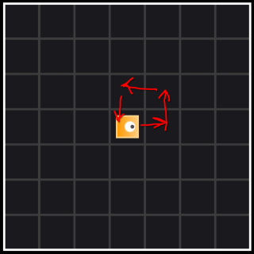

# Aufgaben Intensivbetreuung

## I1: Variablen

### a)

Erstellen Sie eine Variable `number`, die eine ganze Zahl speichern kann.
Initialisieren Sie diese mit dem Ausdruck $3 \cdot \left(4 - 2\right)$.
Erstellen Sie eine weitere Variable `text` des Typen `String` und initialisieren Sie mit der Zeichenkette,
die sich aus der Konkatenation von `"Das ist die Zahl: "` und `number` ergibt.
Geben sie die Zeichenkette auf der Konsole aus, die in `text` gespeichert ist.

### b)

Betrachten Sie das folgende Code-Beispiel. Welche Fehler werden bei der Übersetzung entstehen?

```java
int number = "5";
number = number + 1;
String numberText = number;
System.out.println(numberText);
```

### c)

Markieren Sie in dem folgenden Code, wo auf die Variablen `x` und `message` zugegriffen werden kann.

```java
int x = 10 / 2;

if (x > 2) {
	String message = "x ist größer als 2!"
	System.out.println(message);
}

System.out.println("x = " + x);
```

### d)

## I2: Programmfluss

### a)

Gegeben sei der Integer `age`, in dem das Alter einer Person gespeichert ist. Schreiben Sie eine `if-else`-Anweisung,
die überprüft, ob die Person volljährig ist.
Wenn sie volljährig ist, soll `"Du bist volljährig"` auf der Konsole ausgegeben werden. Ansonsten soll ausgegeben
werden, wie viele Jahre noch zur Volljährigkeit fehlen.

### b)

Berechnen Sie die Summe $\sum_{i=0}^{42} 2i$ mit einer `for`-Schleife und geben Sie sie auf der Konsole aus.
Zur Kontrolle: Das Ergebnis soll $1806$ sein.

### c)

Wir simulieren einen Raketenstart und wollen einen Countdown auf der Konsole ausgeben, der von $10$ bis $1$ in Sekunden
herunter zählt und anschließend `"Start"` ausgibt.
Um eine Sekunde zu warten, verwenden Sie die Anweisung `waitSecond();`.

### d)

Schreiben Sie ein Programm, das alle geraden Zahlen in $[0, 100]$ aufsummiert. Sie dürfen hierfür keine `if`-Anweisung
verwenden.
Zur Kontrolle: Das Ergebnis soll $2550$ sein.

### e)

Schreiben sie einen Algorithmus, der überprüft, ob ein `int`-Array Duplikate enthält.
Wenn ein Duplikat gefunden wird, sollen beide Indizes ausgegeben werden, an denen das gleiche Element ist.

### f)

Programmieren Sie eine Passwortüberprüfung. Das Programm fragt einen Nutzer so lange auf der Konsole nach einer Eingabe,
bis er das Richtige Passwort in die Konsole eingegeben hat.
Nachdem das richtige Passwort eingegeben wurde, gibt das Programm eine positive Nachricht aus und terminiert.
Nutzen Sie zum einlesen einer Konsolen-Zeile `readLine();`. Überlegen Sie sich, welcher Schleifentyp hier besonders
elegant ist!

## I3: FOPBot

### a)

Sei `bob` ein `Robot`. Bob hat eine gewisse Anzahl Münzen, die er ablegen will.
Schreiben sie eine `while`-Schleife, in der Bob *so lange* eine Münze ablegt, wie er noch Münzen hat.

### b)

Schreiben Sie ein Programm, das mit einem Roboter aus Münzen eine Treppe legt (siehe Abbildung).
Der Roboter befindet sich zu Beginn bei Position $(0, 0)$ und schaut nach rechts.
Sie dürfen davon ausgehen, dass der Roboter genügend Münzen hat.


### c)

Sei `robot` ein Roboter. Drehen Sie den Roboter so lange, bis er nach oben schaut.
Nach jeder Drehung warten Sie eine Sekunde, in dem Sie `waitSecond();` aufrufen.

Anschließend soll sich der Roboter einmal um seine eigene Achse drehen. Nach jeder Drehung soll er wieder eine Sekunde
warten.

Zuletzt soll der Roboter sich so lange im Kreis drehen und Münzen ablegen (siehe Abbildung), bis er keine Münzen mehr
hat.
Dafür soll der Roboter sich *erst* bewegen und *danach* überprüfen, ob er noch Münzen hat.
Überlegen Sie sich, welcher Schleifentyp hier besonders gut geeignet ist.



## I4: Methoden

### a)

#### i)

Erstellen Sie in der Klasse `Main` eine `private` Methode `sayHello`.
Diese Methode hat keinen Rückgabewert und hat keine formalen Parameter.
Die Methode soll `"Hello, world!"` auf der Konsole ausgeben.

Fügen Sie vor dem Rückgabetypen der Methode das Schlüsselwort `static` ein.
Rufen sie nun die Methode aus der `main`-Methode auf.

#### ii)

Fügen Sie nun zu der Methode den formalen Parameter `name` des Typen `String` hinzu.
Ändern Sie die Konsolen-Ausgabe zu `"Hello, <name>!"`, wobei `<name>` durch den aktualen Parameter `name` ersetzt werden
soll.

Verändern Sie den Aufruf der Methode so, dass sie `"Hello, Bob!"` auf der Konsole ausgeben wird.

### b)

Schreiben Sie eine neue Methode `square`, die `public` und `static` ist.
Die Methode soll einen `double` namens `x` als Parameter entgegennehmen und einen `double` zurückgeben.
Gebe Sie innerhalb der Methode den Wert von $x^2$ zurück.

Probieren Sie die Methode mit einigen Eingaben in der `main`-Methode aus und geben Sie die Ergebnisse aus.

### c)

Erstellen Sie eine `private`-Methode `averageLength`, die aus einem als Parameter übergebenen `String`-Array
die durchschnittliche Länge der `String`s als `float` zurückgibt.

### d)

Programmieren Sie eine Methode mit Default-Visibility, die einen `boolean` zurückgibt.
Diese Methode soll genau dann `true` zurückgeben, wenn zwei als Parameter übergebene `double`s
sich um weniger als $0,1$ unterscheiden.
Überlegen Sie sich selbst einen sinnvollen Namen für die Methode und die formalen Parameter.

## I5: Eigene Klassen

### a)

#### i)

Erstellen Sie in dem Package `intensiv` eine neue `public`-Klasse namens `Car`.
In unserer Welt hat jedes Auto folgende Eigenschaften:

- Modellname
- Anzahl Sitze
- Kraftstoffverbrauch pro 100 km
- Leistung in PS

Modellieren Sie diese Eigenschaften durch Attribute.
Überlegen Sie sich dafür sinnvolle Namen und Typen der Attribute.

Schreiben Sie nun einen Konstruktor, der alle diese Attribute mit als Parameter übergebenen Werten initialisiert.

#### ii)

Erstellen Sie in der neuen Klasse eine `public`-Methode namens `honk`, die nichts zurückgibt und keine Parameter nimmt.
Sie soll `"Beep"` auf der Konsole ausgeben.

#### iii)

Erstellen Sie analog zu **i)** eine weitere Klasse `PickUp`, welche Pick-Ups modellieren soll.
Die Klasse erbt von `Car` und hat ein weiteres Attribut:

- Ladekapazität in kg

Die Klasse soll einen Konstruktor haben, die alle für `Car` relevanten Konstruktor-Parameter weiterreicht
und die eigenen Attribute mit aktualen Parametern initialisiert.

#### iv)

Überschreiben Sie in `PickUp` die `honk`-Methode. Die neue Methode soll `"Mööp"` ausgeben.

## I6: Interfaces

Nachdem Sie nun eigene Klassen erstellt haben, werden wir uns nun mit Interfaces beschäftigen.
Alle Klassen und Interfaces sind im Package `intensiv` zu erstellen.

### a)

In der Vorlage ist das Interface `DoubleToDoubleFunction` gegeben, was ähnlich zu dem ist, was Sie bereits
aus der Vorlesung kennen.

Die Methode `apply` bildet den übergebenen `x`-Wert auf einen Funktionswert ab.
Die Methode `isDefined` gibt einen `boolean` zurück, der ausdrückt, ob die Funktion für den gegebenen `x`-Wert definiert
ist.

Ihre Aufgabe ist es, verschiedene Funktionen zu implementieren, in dem Sie für jede Funktion eine Klasse erstellen, die
das Interface implementiert.

Wenn Sie eine Funktion implementiert haben, können Sie sie wie folgt auf dem Bildschirm plotten:

```java
DoubleToDoubleFunction f = new ... ; // new Instanz der Funktionsklasse
Plotter.plot(f);
```

#### i) Sinus

Implementieren Sie die Funktion $f(x) := sin(x)$. Zur Erinnerung: `sin` ist für *alle* reellen Zahlen definiert.
Zur berechnung des Sinus nutzen Sie die Methode `Math.sin(x)`.

#### ii) Logarithmus zur Basis e

Schreiben nun die Funktion $f(x) := log_{e}(x)$. Achten Sie auf den Definitionsbereich!
Zur Berechnung des Logarithmus finden Sie analog zum Sinus eine passende Methode in der Klasse `Math`.

#### iii) Signum

Implementieren Sie die Signum-Funktion. Sie sieht wie folgt aus:
$$
\begin{equation}
signum(x)=
    \begin{cases}
    -1 & \text{falls } x < 0 \\
    0 & \text{falls } x = 0 \\
    1 & \text{falls } x > 0 \\
    \end{cases}
\end{equation}
$$

Anschaulich bildet Sie eine reelle Zahl auf ihr Vorzeichen ab (`"+"` $\hat=$ `1` und `"-"` $\hat=$ `-1`).
Der Definitionsbereich ist $\mathbb{R}$.

#### iv) Default-Methoden

Verändern Sie das Interface so, dass die Methode `isDefined` nicht immer von der Subklasse implementiert werden muss.
Die Standard-Implementierung soll angaben, dass die Funktion für alle reellen Zahlen definiert ist.

### b)

Nun werden Sie ein eigenes Interface erstellen.

#### i)

Erstellen Sie ein neues Interface `SoundMaker`. Dieses soll eine abstrakte `void`-Methode `makeSound()` ohne Parameter
haben.

#### ii)

Implementieren Sie dieses Interface in einer neuen Klasse `Dog`. Diese Klasse soll die Methode `makeSound`
implementieren,
indem `"Woof Woof!"` auf der Konsole ausgegeben werden soll.

#### iii)

Implementieren Sie das Interface erneut in einer neuen Klasse `PoliceCar` und gehen Sie analog wie in `ii)` vor.
Polizeiautos machen jedoch das Geräusch `"Wee Woo, Wee Woo"`.

#### iv)

Warum war hier die Verwendung eines Interfaces angemessener als die Verwendung einer abstrakten Klasse?

## I7: Racket

Wir wollen uns nun etwas mit Racket beschäftigen. Sie sollen in der Lage sein, Racket Code zu lesen und
äquivalenten Java-Code zu schreiben.

### a)

Wir fangen an mit einfachen Operationen. Wie würden Sie die folgenden Operationen in Java schreiben?

- `(+ 1 2)`
- `(* i (+ 5 42))`
- `(remainder p (/ q 2))`
- `(or (< x y) #f)`

### b)

Jetzt übersetzen Sie ihre erste Funktion zu Java-Code. Gegeben sei folgende Funktion:

```racket
;; Type: number -> natural
;; Returns: the absolute value of x
(define (my-abs x)
  (if (< x 0) (- x) x)
)
```

Anhand der Kommentare können Sie ablesen, welche Typen die Parameter und der Rückgabewert haben.
Implementieren Sie diese Funktion als `public` `static` Java-Methode mit dem Namen `myAbs`.

### c)

Besonders wichtig für Sie zu verstehen, wie rekursive Funktionen auf Listen funktionieren.
Lesen Sie die folgende Racket-Funktion und versuchen Sie, ihre Funktionsweise zu verstehen.

```racket
;; Type: list element -> boolean
;; Returns: true if element is contained in list
(define (contains lst element)
  (cond
    [(empty? lst) #f]
    [(= (first lst) element) #t]
    [else (contains (rest lst) element)]
  )
)
```

Setzen Sie diese Funktion nun als Java-Methode um. Als Liste sollen Sie `int`-Arrays verwenden.
Anstatt den "Rest" der Liste abzuspalten, sollen Sie beim rekursiven Aufruf den Index übergeben,
bei dem der zu behandelnde Teil des Arrays beginnt.

Die Methode soll also die folgende Signature haben:

```java
public static boolean contains(int[] array, int element, int startIndex) {
    ...
}
```

Als Aufrufer der Methode würden Sie wie folgt vorgehen:

```java
contains(array, element, 0); // 0 means start searching at start of array
```

## I8: Funktionale Programmierung in Java

Hier wenden wir uns Functional Interfaces und Lambda-Ausdrücken in Java zu.
Erstellen Sie hierzu zunächst das Package `i8`, in das wir in dieser Aufgabe den Code schreiben werden.

### a)

#### i)

Erstellen Sie zunächst ein Interface namens `StringPredicate`.
Welche Voraussetzungen muss dieses Interface erfüllen, damit es ein Functional Interface ist?

#### ii)

Fügen Sie diesem Interface jetzt seine Functional-Methode `test` hinzu.
Diese soll von `String` auf `boolean` abbilden.

#### iii)

Legen Sie die Klasse `StringTester` an. Hier schreiben Sie eine `public` `static`-Methode `printMatching`.
Diese Methode hat keine Rückgabe und nimmt als Parameter ein `String`-Array und ein `StringPredicate`
entgegen.

Die Methode soll alle Strings auf der Konsole ausgeben, für die die `test`-Methode des `StringPredicate` `true` liefert.

#### iv)

Wir wollen nun den Code testen und begeben uns dafür in die `main`-Methode der `Main`-Klasse.

Erstellen Sie hier ein neues Array, das die folgenden `String`s enthält:

- `"Hallo"`
- `"Hello"`
- `"Hola"`
- `"Bonjour"`

Jetzt rufen Sie die Methode `printMatching` mit diesem Array auf, die Sie gerade geschrieben haben.
Als `StringPredicate` übergeben Sie einen Lambda-Ausdruck, der genau dann true zurückgibt, wenn
der zu testende String mit `"H"` anfängt.
Schauen Sie sich hierzu die Methode `startsWith` der Klasse `String` an.

Verändern Sie das Lambda so, dass es für den übergebenen `String` genau dann `true` zurückgibt,
wenn dieser genau `5` Zeichen lang ist.

#### v)

Haben Sie das Lambda in der Standardform oder in der Kurzform geschrieben?
Schreiben Sie das Lambda nochmal in der anderen Form und überlegen Sie sich, wann welche Form sinnvoll ist.

### b)

Jetzt werden Sie die `map`-Methode implementieren. Diese typische Array-Operation bildet ein Array
auf ein neues Array mit einem neuen Typen ab. Dafür wird eine Funktion $mapper: E1 \rightarrow E2$ verwendet,
wobei $E1$ der Element-Typ des ersten und $E2$ der des zweiten Arrays ist.
Mit dieser Funktion wird jedes Element des ersten Arrays auf ein neues Element abgebildet und im neuen Array
gespeichert.

#### i)

Erstellen Sie ein Functional Interface `IntToStringMapper` mit einer Functional-Methode
$map: int \rightarrow String$.

#### ii)

Schreiben Sie in eine neue Klasse `ArrayOperations` die `public` `static`-Methode `mapArray`,
welche einen Parameter `input` des Typen `int[]` und `mapper` des Typen `IntToStringMapper` hat.
Die Methode gibt ein `String[]` zurück.

In der Methode soll ein neues `String`-Array erstellt werden und mit den durch `mapper` abgebildeten Werten
aus `input` befüllt werden.

Beispiel:

Sei `mapper` eine Funktion, die einen `int` auf seine String-Repräsentation abbildet.
`{1, 2, 3}` wird dann auf `{"1", "2", "3"}` abgebildet.

#### iii)

Rufen Sie diese neue Methode mit einem `int`-Array Ihrer Wahl auf.
Die übergebene `mapper`-Funktion soll ein Lambda sein, die die folgende Funktion realisiert:

$$
\begin{equation}
mapper(i)=
\begin{cases}
    \text{"negativ"}    & \text{falls } i < 0 \\
    \text{"null"}       & \text{falls } i = 0 \\
    \text{"positiv"}    & \text{falls } i > 0 \\
\end{cases}
\end{equation}
$$

## I9: Exceptions

### a)

#### i)

Erstellen Sie im Package `intensiv.exceptions` eine Klasse `NotDefinedException`, die von `Exception` ableitet.
Die Klasse soll einen Konstruktor haben, der einen `double`-Wert x als Parameter besitzt.
Er soll den `super`-Konstruktor der Klasse `Exception` aufrufen, der einen `String`-Parameter besitzt.
Als Argument sollen Sie diesem `super`-Konstruktor `"Undefined value: " + x` übergeben.

#### ii)

In der Klasse `I9` finden Sie die Methode `calculateLog`. Verändern Sie die Signatur so, dass die `NotDefinedException`
in der Methode geworfen werden darf. Nun sollen Sie prüfen, ob der aktuale Parameter `x` kleiner oder gleich $0$ ist.
Wenn das der Fall ist, soll eine neue `NotDefinedException` geworfen werden und ihrem Konstruktor der x-Wert übergeben
werden.

#### iii)

Rufen Sie in `main` die Methode mit einem `double`-Wert auf, der kleiner als oder gleich $0$ ist.
Der Compiler wird Sie dazu zwingen, die Signatur der `main`-Methode ebenfalls anzupassen.

Was passiert, wenn aus der `main`-Methode eine Exception herausfliegt, ohne gefangen zu werden?

#### iv)

Schreiben Sie die `main`-Methode nun so um, dass die Exception gefangen wird.
Wenn eine Exception auftritt, soll sie gefangen werden und auf der Konsole soll ihre Nachricht ausgegeben werden.

### b)

Erklären Sie den Unterschied zwischen Exceptionklassen, die von `RuntimeException` ableiten, und solchen, die das nicht
tun.

## I10: Generics und Collections

Das nächste Thema ist Generics, insbesondere in Verbindung mit Collections.
Alle Methoden dazu werden in `intensiv.i10.GenericOperations` implementiert.

### a)

#### i)

Erstellen Sie eine `public` `static` Methode `findMin`, die einen `Integer` zurückgibt und eine `Integer`-Collection
als Parameter entgegennimmt.

Diese Methode soll die kleinste Zahl der Collection finden und zurückgeben.
Wenn es keine gibt, können Sie `null` zurückgeben.

#### ii)

Wir wollen jetzt diese Methode weiter verallgemeinern. Man kann schließlich nicht nur das Minimum von `Integer`n
bestimmen, sondern auch von `Double`s oder allem, was total geordnet ist.

Verändern Sie den Parameter so, dass alle Collections akzeptiert werden, die Elemente speichern,
die das Interface `Comparable` implementieren. Rufen Sie sich die Funktionsweise von `Comparable` in Erinnerung.

Sie können nun mithilfe der `compare`-Methode das Minimum bestimmen.
Sie müssen jetzt den Rückgabetyp der Methode so anpassen, dass wieder jedes Element der Collection zurückgegeben werden
darf.

#### iii)

Wie Sie bemerkt haben, ist der Rückgabetyp in `ii)` noch nicht sonderlich elegant.
Deshalb werden wir jetzt die Methode mit noch weiter verallgemeinern, sodass sie ihr volles Potenzial ausreizt.

Fügen Sie der Methode den Typ-Parameter `T` hinzu. Achten Sie darauf, dass `T` nur mit Typen instantiiert werden darf,
die `Comparable<T>` implementieren. Ändern Sie nun den Collection-Parameter so, dass die Collection Elemente des Typen
`T` speichert.
Jetzt ist es Ihnen möglich, den Rückgabetyp zu `T` zu verändern.

Jetzt ist die Methode vollständig *generifiziert* und kann für alle Ermittlungen von Minima verwendet werden!

### b)

Erstellen Sie nun ein generisches Functional Interface `GenericPredicate` im Package `i10`.
Dieses soll einen Typ-Parameter `T` haben. Die funktionale Methode soll diese Signatur haben:

$\text{test} : T \rightarrow boolean$

Welchen Vorteil haben generische Functional Interfaces? Gibt es auch Nachteile?

## I11: Verkettete Listen

Im Package `intensiv.i11` finden Sie die Klassen `MyLinkedList` und `ListItem`,
die Sie so ähnlich bereits aus der Vorlesung kennen.
Machen Sie sich mit den beiden Klassen vertraut.

Für dieser Aufgabe gibt es Tests, um ihre Implementierungen zu testen.
Zum Ausführen klicken Sie rechts auf das Elefanten-Symbol und führen Sie `verification/test` aus.

### a)

Erklären Sie den Aufbau einer (einfach) verketteten Liste.
Welche Funktion hat das `head` Attribut in der `MyLinkedList` Klasse?

### b)

Implementieren Sie die Methode `add(T)` aus `MyLinkedList`.
Diese Methode soll den übergebenen `key` in ein `ListItem` verpacken und dieses *vorne* in die Liste einfügen.
Achten Sie auch darauf, dass die Liste zu Beginn leer sein kann.

Welche Möglichkeiten gäbe es, das neue Element immer *hinten* anzuhängen?

### c)

Implementieren Sie die Methode `contais(T)`. Diese soll genau dann `true` zurückgeben,
falls sich in der verketteten Liste ein `ListItem` mit dem als Parameter übergebenen `key` befindet.

Die Art, durch eine verkettete Liste zu iterieren, sollten Sie sich gut merken!

### d)

Ergänzen Sie die Methode `get(int)`. Diese Methode soll den `key` des `ListItem` zurückgeben,
der an `index`ter Stelle in der Liste steht.
Falls `index` größer oder gleich der Länge der List ist, werfen Sie eine `IndexOutOfBoundsException`
mit `index` als Konstruktor-Argument.
Der Fall, dass `index` negativ oder die Liste leer ist, ist bereits vorgegeben.

*Beispiel:*

Gegeben sei die verkettete Liste `list` mit  `"Hello" -> "World" -> "Kuchen" -> "lecker"`.
Dann ergibt `index(0) == "Hello"`, `list(3) == "lecker`" und `list(4)` wirft eine Exception.
